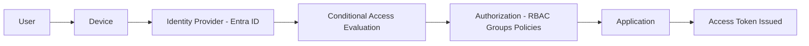

# Identity Landscape Overview  
SC‑300: Microsoft Identity and Access Administrator  
Module 01 — Explore Identity in Microsoft Entra ID  

## Overview  
The identity landscape represents the systems, processes, and controls that determine how users authenticate, how access is authorized, and how identities are governed across an organization. This document provides a foundational overview of identity concepts in Microsoft Entra ID and establishes the base for subsequent SC‑300 labs.

---

## Components of the Identity Landscape  

### Identity Providers  
Identity providers (IdPs) authenticate users and issue tokens that applications rely on.  
Examples include:  
- Microsoft Entra ID  
- Active Directory Domain Services (AD DS)  
- Okta  
- PingFederate  
- Google Identity  

### Directories  
Directories store and manage identity objects such as users, groups, and devices.  
- Entra ID is a cloud-based directory.  
- AD DS is an on‑premises directory service.  

### Authentication Methods  
Authentication verifies a user’s identity. Common methods include:  
- Password  
- Multi‑factor authentication (MFA)  
- FIDO2 security keys  
- Windows Hello for Business  
- Certificate‑based authentication  

### Authorization Models  
Authorization determines what a user can access after authentication.  
Common models include:  
- Role‑Based Access Control (RBAC)  
- Attribute‑Based Access Control (ABAC)  
- Group‑based access  
- Conditional Access policies  

### Identity Governance  
Identity governance ensures that users have appropriate access throughout their lifecycle.  
Key components include:  
- Access reviews  
- Lifecycle workflows  
- Entitlement management  
- Terms of use  

### External Identities  
External identities represent users outside the organization who require access to internal resources.  
Examples include:  
- B2B guest users  
- Cross‑tenant access  
- Federated identity providers  
- Vendors and partners  

---

## Identity Flow Overview

A high‑level identity flow typically includes:

1. User attempts to sign in  
2. Device posture is evaluated  
3. Authentication occurs via the identity provider  
4. Conditional Access evaluates risk and context  
5. Authorization is granted  
6. Application issues access via tokens

---

## Real‑World Example  
While supporting an external business partner, the partner was unable to open encrypted email attachments and received the message:

“You don’t have an account in this tenant.”

This scenario illustrates several identity concepts:  
- The partner was not recognized as a guest user in the tenant (external identities).  
- Their identity provider could not authenticate them into the organization’s tenant (authentication).  
- Without guest access or proper sharing permissions, authorization failed.  
- The resolution required evaluating whether to add the partner as a guest or use secure sharing options (governance and access control).  

This example demonstrates how identity, authentication, authorization, and collaboration intersect in real environments.

---

## Lab Summary  
This introductory lab covered:  
- Mapping the core components of the identity landscape  
- Reviewing a high‑level identity flow  
- Connecting identity concepts to a real‑world support scenario  
- Preparing the foundation for deeper SC‑300 labs  

---

## Key Takeaways  
- Identity is the primary control plane in modern security architectures.  
- Authentication verifies who a user is; authorization determines what they can access.  
- External identities require explicit configuration and governance.  
- Microsoft Entra ID provides the core identity services for cloud‑based environments.  
