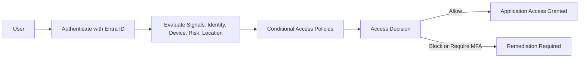

# Module 02 — Zero Trust with Identity  
SC‑300: Microsoft Identity and Access Administrator

## Overview  
Modern organizations operate across hybrid and multicloud environments, support mobile workforces, and expose applications and data beyond traditional network boundaries. Because of this, perimeter‑based security models are no longer sufficient.

Zero Trust provides a security strategy built on the assumption that no request is inherently trusted. Every access attempt must be verified using identity, device posture, risk, and session context. Microsoft Entra ID acts as the control plane that evaluates these signals and enforces access decisions.

---

## Zero Trust Principles  

### 1. Verify Explicitly  
Always validate access using all available signals, including:  
- User identity  
- Location  
- Device health  
- Service or workload context  
- Risk level  
- Anomalies  

### 2. Use Least Privilege Access  
Limit access to only what is required by enforcing:  
- Just‑in‑time (JIT) access  
- Just‑enough‑access (JEA)  
- Role‑based access control (RBAC)  
- Segmentation based on user, device, network, and application context  

### 3. Assume Breach  
Design systems with the expectation that attackers may already be inside the environment.  
This requires:  
- End‑to‑end encryption  
- Continuous monitoring  
- Risk‑based adaptive policies  
- Threat analytics and posture visibility  

---

## Identity as the Zero Trust Control Plane  
Identity is the foundation of Zero Trust. When an identity attempts to access a resource, the system must:  
- Authenticate the identity with strong methods  
- Evaluate device posture and sign‑in risk  
- Apply Conditional Access policies  
- Enforce least privilege  
- Continuously reassess trust throughout the session  

Microsoft Entra ID provides the policy engine that evaluates signals and makes dynamic access decisions.

---

## Zero Trust Access Flow  

---

## Zero Trust Architecture Components  
Microsoft’s Zero Trust architecture spans six foundational elements. Each acts as a source of signal, a control plane, and a resource to protect:

- Identity — verifies users and devices explicitly  
- Devices — enforce compliance and health requirements  
- Applications — enforce access controls and session protections  
- Data — classify, label, and protect sensitive information  
- Infrastructure — secure workloads and cloud resources  
- Networks — detect and respond to threats across traffic flows  

Identity is the focus of this module, but all pillars work together to enforce Zero Trust at scale.

---

## Real‑World Example  
A user attempts to access Microsoft 365 from a personal, unmanaged laptop.  
The organization has Conditional Access policies requiring:  
- Compliant device  
- MFA  
- Approved client apps  

Even though the user’s credentials are valid, the device fails compliance checks.  
Access is blocked, and the user is prompted to enroll the device or switch to a compliant workstation.

This demonstrates Zero Trust enforcement:  
- Identity authenticated  
- Device posture evaluated  
- Conditional Access applied  
- Access denied based on risk and policy  

---

## Key Takeaways  
- Zero Trust assumes breach and verifies every request.  
- Identity is the central enforcement point for Zero Trust in Microsoft Entra ID.  
- Conditional Access is the primary mechanism for evaluating signals and enforcing policy.  
- Least privilege, strong authentication, and continuous monitoring are essential.  
- Zero Trust is not a product — it is an end‑to‑end security strategy.
